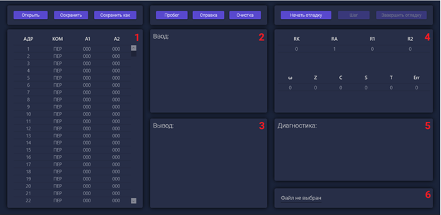
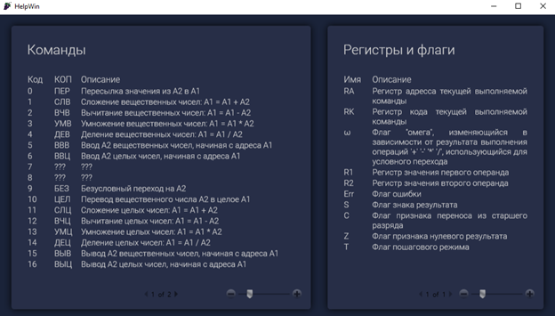
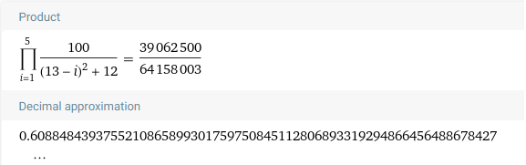
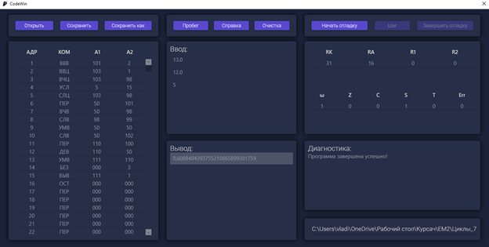

# 🖥️ Computing Machine Emulator

An educational custom computer based on the **von Neumann architecture**, designed to execute a set of programmed instructions. The emulator supports **data input/output, arithmetic operations** (addition, subtraction, multiplication, division, remainder calculation), **data transfers between memory locations**, and **conditional/unconditional branching** for altering program flow.

---

## 🚀 Interface Demo

### 🏠 Main Window

#### 🔍 Description:
1️⃣ **Code Table** – Users can input and edit program commands with **integer and floating-point numbers**. Editing is locked during execution and re-enabled upon program completion.

2️⃣ **Input Window** – During execution, user prompts for data entry appear. If incorrect values are provided, execution halts with an error message. Valid inputs are displayed in the "Input Data" window.

3️⃣ **Output Window** – Displays the program's output as **integer or floating-point numbers**.

4️⃣ **Register & Flag Panel** – Updates dynamically during execution, visually demonstrating program flow in step-by-step mode.

5️⃣ **Diagnostics Window** – Displays program-generated messages, warnings, and errors.

6️⃣ **File Path Panel** – Shows the currently opened file path.

7️⃣ **Control Panel** – Contains key functional buttons:
   - 📁 **Save, Save As, Open, Help, Clear**
   - ▶️ **Run**: Executes the program
   - 🐞 **Start Debugging**: Initiates step-by-step execution
   - ⏭️ **Step**: Moves to the next command
   - ⏹️ **End Debugging**: Stops step-by-step execution

---

### 📖 Help Window

#### 📝 Commands Table:
| Code | Mnemonic | Description |
|------|---------|-------------|
| 0    | ПЕР     | Assign A2 to A1 |
| 1    | СПЛ     | Add floating-point: A1 = A1 + A2 |
| 2    | ВЛП     | Subtract floating-point: A1 = A1 - A2 |
| 3    | УМВ     | Multiply floating-point: A1 = A1 * A2 |
| 4    | ДЕЛ     | Divide floating-point: A1 = A1 / A2 |
| 5    | ВВЩ     | Input A2 floating-point numbers starting from A1 |
| 6    | ВВЦ     | Input A2 integers starting from A1 |
| 7    | ---     | Reserved |
| 8    | ---     | Reserved |
| 9    | БЕЗ     | Unconditional jump to A2 |
| 10   | СПЦ     | Convert floating-point A2 to integer A1 |
| 11   | СЛЦ     | Add integers: A1 = A1 + A2 |
| 12   | ВЛЦ     | Subtract integers: A1 = A1 - A2 |
| 13   | УМЦ     | Multiply integers: A1 = A1 * A2 |
| 14   | ДЕЦ     | Divide integers: A1 = A1 / A2 |
| 15   | ВЫВ     | Output A2 floating-point numbers from A1 |
| 16   | ВЫЦ     | Output A2 integers from A1 |

#### 🔍 Registers and Flags:
| Name | Description |
|------|-------------|
| RA   | Register of the current instruction address |
| RK   | Register of the current instruction code |
| ω    | "Omega" register, changes based on arithmetic operations for conditional jumps |
| R1   | Register for the first operand |
| R2   | Register for the second operand |
| Err  | Error flag |
| S    | Sign flag |
| C    | Carry flag |
| Z    | Zero flag |
| T    | Step-by-step execution flag |

---

## 📊 Calculation Demo

### 🔢 WolframAlpha Result

### 🖥️ Machine Computation Result

